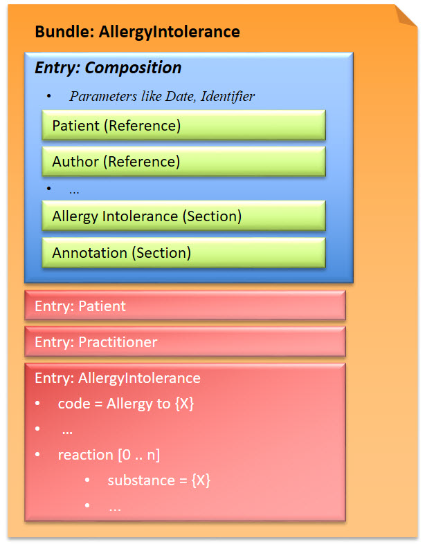
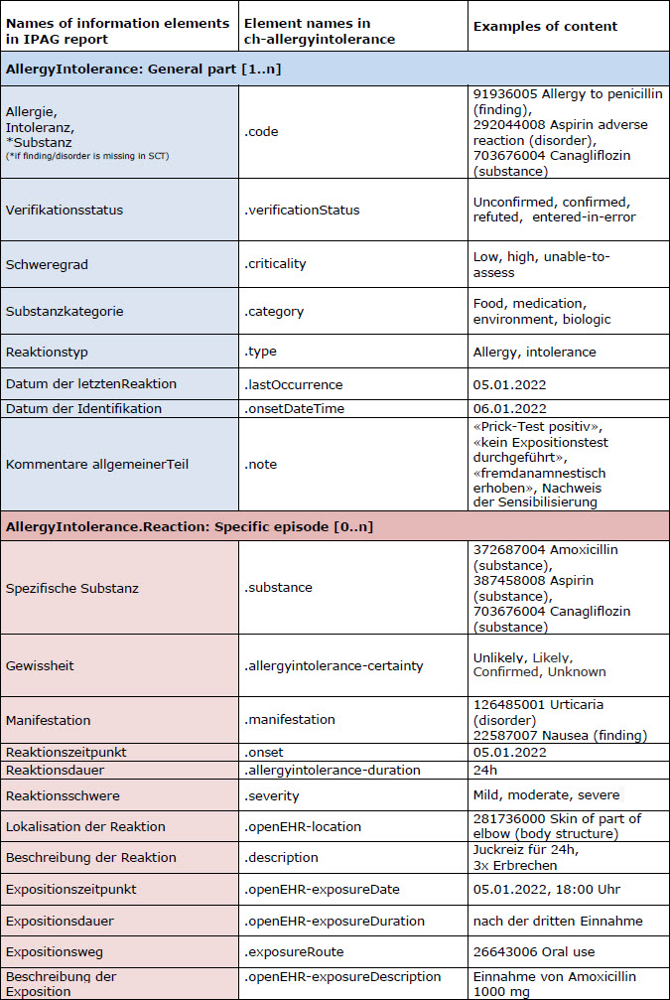

# Allergy Intolerance Document - CH AllergyIntolerance (R4) v3.0.1

* [**Table of Contents**](toc.md)
* **Allergy Intolerance Document**

## Allergy Intolerance Document

The Allergy Intolerance document describes the current allergies and intolerances of a patient, and related reactions.

### FHIR document (Bundle)

This exchange format is defined as a document type that corresponds to a Bundle as a FHIR resource. A Bundle has a list of entries. The first entry is the Composition, in which all contained entries are then referenced.

*Fig.: Allergy Intolerance Bundle Overview*

### Assignment IPAG report to ch-allergyintolerance-elements

*Fig.: IPAG report ch-allergyintolerance-elements*

### Example instance

* CH-AllergyIntolerance-Document-Example: [XML](Bundle-ch-allergyintolerance-document-example.xml.md), [JSON](Bundle-ch-allergyintolerance-document-example.json.md)

### Profile

* [CH AllergyIntolerance Document](StructureDefinition-ch-allergyintolerance-document-epr.md)

