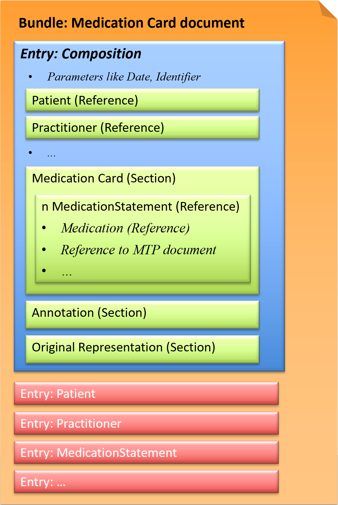

# Medication Card document - CH EMED (R4) v6.0.0

* [**Table of Contents**](toc.md)
* **Medication Card document**

## Medication Card document

The **Medication Card document** provides as complete an overview as possible of all current medications for a patient at a given point in time (such as the end of a hospitalization or other encounter). The purpose of this document is to inform the patient and clinicians (therapists, etc.) of the current medication information.

* [IPAG report](https://www.e-health-suisse.ch/fileadmin/user_upload/Dokumente/2017/D/170607_Bericht_eMedikation_IPAG.pdf): eCurrentMedication, different view
* [IHE Pharmacy Technical Framework Supplement: Community Medication List (PML)](https://www.ihe.net/uploadedFiles/Documents/Pharmacy/IHE_Pharmacy_Suppl_PML.pdf)

### FHIR document (Bundle)

This exchange format is defined as a document type that corresponds to a Bundle as a FHIR resource. A Bundle has a list of entries. The first entry is the Composition, in which all contained entries are then referenced.

The representation of the Medication Card document SHALL be embedded as a PDF in PDF/A-1 or PDF/A-2 format. The required elements in the PDF correspond to the minimum data set in the IPAG report. In the FHIR profiles, the flag [mustSupport](index.md#mustsupport) is set to `true` for these elements.

*Fig.: Medication Card document*

#### Example instances

* 2-7 Medication Card document: [XML](Bundle-2-7-MedicationCard.xml.md), [JSON](Bundle-2-7-MedicationCard.json.md)
* 2-7 Medication Card document with UUID for fullUrl: [XML](Bundle-2-7-MedicationCard-UUIDfullUrl.xml.md), [JSON](Bundle-2-7-MedicationCard-UUIDfullUrl.json.md)

### Profiles

* [CH EMED Medication Card Document](StructureDefinition-ch-emed-document-medicationcard.md)
* [CH EMED Medication Card Composition](StructureDefinition-ch-emed-composition-medicationcard.md)
* [CH EMED MedicationStatement (CARD)](StructureDefinition-ch-emed-medicationstatement-card.md)
* [CH EMED Medication](StructureDefinition-ch-emed-medication.md)
* [CH EMED Dosage](StructureDefinition-ch-emed-dosage.md)
* [CH EMED Dosage Split](StructureDefinition-ch-emed-dosage-split.md)

