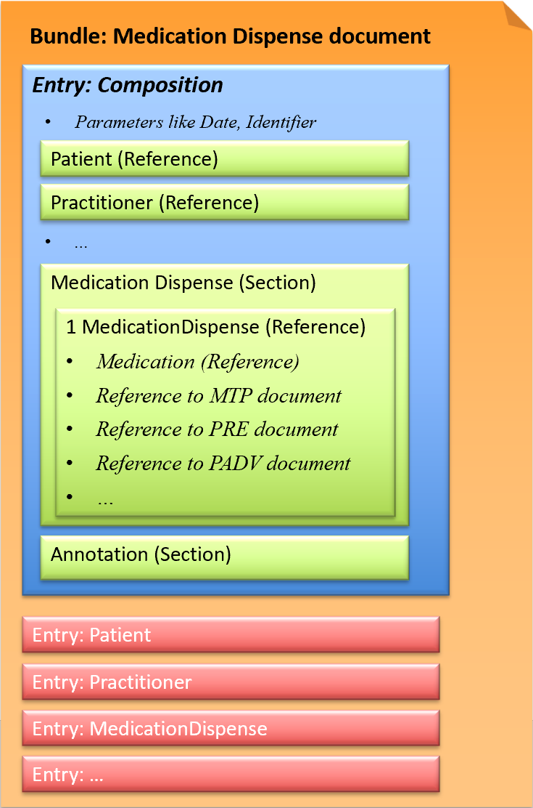

# Medication Dispense document - CH EMED (R4) v6.0.0

* [**Table of Contents**](toc.md)
* **Medication Dispense document**

## Medication Dispense document

The **Medication Dispense document** describes the direct **dispensation** of ONE drug to a patient or legitimized third party with regard to a later **application** of the product by a qualified health professional.

* [IPAG report](https://www.e-health-suisse.ch/fileadmin/user_upload/Dokumente/2017/D/170607_Bericht_eMedikation_IPAG.pdf): eDispense
* [IHE Pharmacy Technical Framework Supplement: Community Dispense (DIS)](https://www.ihe.net/uploadedFiles/Documents/Pharmacy/IHE_Pharmacy_Suppl_DIS.pdf)
* [IHE Pharmacy Technical Framework Supplement: Community Medication Administration (CMA)](https://www.ihe.net/uploadedFiles/Documents/Pharmacy/IHE_Pharmacy_Suppl_CMA.pdf)

### FHIR document (Bundle)

This exchange format is defined as a document type that corresponds to a Bundle as a FHIR resource. A Bundle has a list of entries. The first entry is the Composition, in which all contained entries are then referenced.

*Fig.: Medication Dispense document*

#### Example instances

* 1-2 Medication Dispense document: [XML](Bundle-1-2-MedicationDispense.xml.md), [JSON](Bundle-1-2-MedicationDispense.json.md)
* 2-4 Medication Dispense document: [XML](Bundle-2-4-MedicationDispense.xml.md), [JSON](Bundle-2-4-MedicationDispense.json.md)

### Profiles

* [CH EMED Medication Dispense Document](StructureDefinition-ch-emed-document-medicationdispense.md)
* [CH EMED Medication Dispense Composition](StructureDefinition-ch-emed-composition-medicationdispense.md)
* [CH EMED MedicationDispense (DIS)](StructureDefinition-ch-emed-medicationdispense.md)
* [CH EMED MedicationAdministration (DIS)](StructureDefinition-ch-emed-medicationadministration.md)
* [CH EMED Medication (MedicationDispense)](StructureDefinition-ch-emed-medication-medicationdispense.md)
* [CH EMED Dosage](StructureDefinition-ch-emed-dosage.md)
* [CH EMED Dosage Split](StructureDefinition-ch-emed-dosage-split.md)

