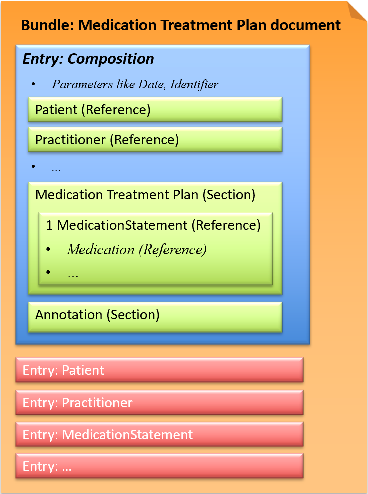

# Medication Treatment Plan document - CH EMED (R4) v6.0.0

* [**Table of Contents**](toc.md)
* **Medication Treatment Plan document**

## Medication Treatment Plan document

The **Medication Treatment Plan document** describes ONE medication of a patient, a medication that has been, is or will be taken by the patient.

* [IPAG report](https://www.e-health-suisse.ch/fileadmin/user_upload/Dokumente/2017/D/170607_Bericht_eMedikation_IPAG.pdf): eMedicationTreatmentPlan
* [IHE Pharmacy Technical Framework Supplement: Community Medication Treatment Plan (MTP)](https://www.ihe.net/uploadedFiles/Documents/Pharmacy/IHE_Pharmacy_Suppl_MTP.pdf)

### FHIR document (Bundle)

This exchange format is defined as a document type that corresponds to a Bundle as a FHIR resource. A Bundle has a list of entries. The first entry is the Composition, in which all contained entries are then referenced.

*Fig.: Medication Treatment Plan document*

#### Example instances

* 1-1 Medication Treatment Plan document: [XML](Bundle-1-1-MedicationTreatmentPlan.xml.md), [JSON](Bundle-1-1-MedicationTreatmentPlan.json.md)
* 2-3 Medication Treatment Plan document: [XML](Bundle-2-3-MedicationTreatmentPlan.xml.md), [JSON](Bundle-2-3-MedicationTreatmentPlan.json.md)
* 2-5 Medication Treatment Plan document: [XML](Bundle-2-5-MedicationTreatmentPlan.xml.md), [JSON](Bundle-2-5-MedicationTreatmentPlan.json.md)

### Profiles

* [CH EMED Medication Treatment Plan Document](StructureDefinition-ch-emed-document-medicationtreatmentplan.md)
* [CH EMED Medication Treatment Plan Composition](StructureDefinition-ch-emed-composition-medicationtreatmentplan.md)
* [CH EMED MedicationStatement (MTP)](StructureDefinition-ch-emed-medicationstatement.md)
* [CH EMED Medication](StructureDefinition-ch-emed-medication.md)
* [CH EMED Dosage](StructureDefinition-ch-emed-dosage.md)
* [CH EMED Dosage Split](StructureDefinition-ch-emed-dosage-split.md)

