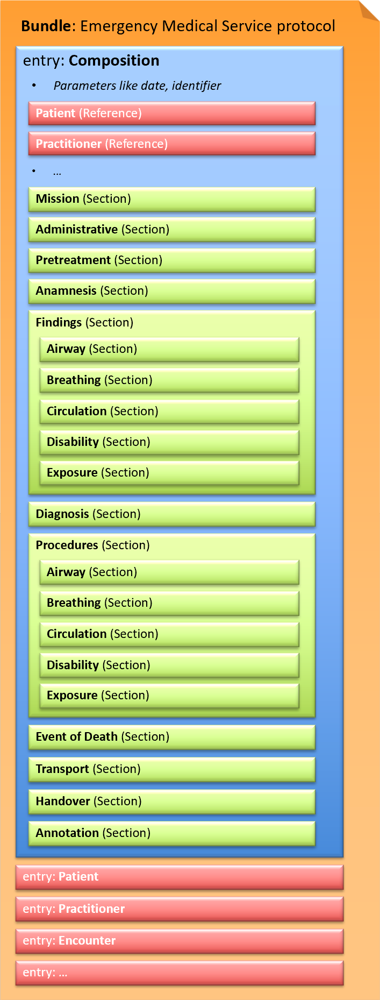

# FHIR Document (Bundle) - CH EMS (R4) v2.0.0-ballot

* [**Table of Contents**](toc.md)
* **FHIR Document (Bundle)**

## FHIR Document (Bundle)

This exchange format is defined as a [document](https://hl7.org/fhir/R4/documents.html) type that corresponds to a [Bundle](https://hl7.org/fhir/R4/bundle.html) as a FHIR resource. A Bundle contains a list of entries. The first entry is the [Composition](https://hl7.org/fhir/R4/composition.html), in which all contained entries are then referenced.

*Fig.: Schematic document structure for CH EMS*

### Document Profile

[Emergency Medical Service protocol](StructureDefinition-ch-ems-document.md)

### Document Examples

* Use Case 1: **Primary mission** with identifiable patient; EPR conform (mostly structured data) 
* Emergency Medical Service protocol 1 (upon handover of the patient): [JSON](Bundle-1-Einsatzprotokoll.json.md), [XML](Bundle-1-Einsatzprotokoll.xml.md)
* Emergency Medical Service protocol 1b (completion of mission, including all administrative and billing-related data): [JSON](Bundle-1b-Einsatzprotokoll.json.md), [XML](Bundle-1b-Einsatzprotokoll.xml.md)
 
* Use Case 2: **Primary mission** with unknown patient; NOT EPR conform (combination of structured data and free text) 
* Emergency Medical Service protocol 2 (upon handover of the patient): [JSON](Bundle-2-Einsatzprotokoll.json.md), [XML](Bundle-2-Einsatzprotokoll.xml.md)
* Emergency Medical Service protocol 2b (completion of mission, including all administrative and billing-related data): [JSON](Bundle-2b-Einsatzprotokoll.json.md), [XML](Bundle-2b-Einsatzprotokoll.xml.md)
 

