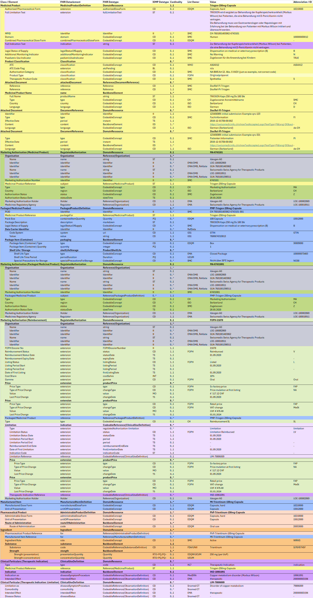

# Triogen - CH EPL (R5) v1.0.0

* [**Table of Contents**](toc.md)
* **Triogen**

## Triogen

In diesem Kapitel sind unterschiedliche Produkte im IDMP / FHIR Format abgebildet.

### TRIOGEN Kaps 250 mg Ds 100 Stk

The following example demonstrates the structure of the product TRIOGEN Kaps 250 mg Ds 100 Stk

#### Description

Triogen ist ein Orphan Drug, d.h. ein Produkt zur Behandlung von seltenen Krankheiten.

*Abb. 6: TRIOGEN Kaps 250 mg Ds 100 Stk, Quelle: compendium.ch*

#### FHIR Example

Representation of IDMP data attributes as FHIR XML and JSON: [FHIR Beispiel](Bundle-c97d5d89-4467-4c1e-9954-9d1e1d1d46e2.md)

#### IDMP Data Example

Overview of IDMP data elements in the FHIR structure: 

*Fig. 1: IDMP Datamodel - Triogen*

