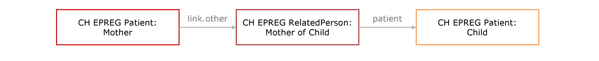

# Child Relationships - CH EPREG (R4) v1.0.0

* [**Table of Contents**](toc.md)
* **Child Relationships**

## Child Relationships

### Child and Mother

The relationship between the **biological mother** and her **child (fetus/newborn)** is modeled using the `Patient` and `RelatedPerson` resources, as depicted in the figures below. This approach follows the guidelines outlined in the [Mother and newborn relationships](https://hl7.org/fhir/R4/patient.html#maternity) section of the FHIR specification and the [International Birth And Child Model Implementation Guide](https://hl7.org/fhir/uv/ibcm/2024Sep/index.html).

#### Mother with her Single Child

*Fig.: Relationship between the biological mother and her single child*

**Example instances:** 
 [Patient: Mother](Patient-UC1-KatrinKinderlieb.md) –> [RelatedPerson: Mother](RelatedPerson-UC1-RelatedPerson-Mother.md) –> [Patient: Child](Patient-UC1-Child.md)

**Profiles:** 
 [CH EPREG Patient: Mother](StructureDefinition-ch-epreg-patient-mother.md) –> [CH EPREG RelatedPerson: Mother](StructureDefinition-ch-epreg-relatedperson-mother.md) –> [CH EPREG Patient: Child](StructureDefinition-ch-epreg-patient-child.md)

#### Mother with her Multiple Children

*Fig.: Relationship between the biological mother and her multiple children (e.g. twins)*

**Example instances:** 
 [Patient: Mother](Patient-UC3-SophieDoppelherz.md) 
 –> [RelatedPerson: Mother - Child A](RelatedPerson-UC3-RelatedPerson-ChildA-Mother.md) –> [Patient: Child A](Patient-UC3-ChildA.md) 
 –> [RelatedPerson: Mother - Child B](RelatedPerson-UC3-RelatedPerson-ChildB-Mother.md) –> [Patient: Child A](Patient-UC3-ChildB.md)

#### Encounters/Observations of Mother and Child

*Fig.: Encounters and observations of the biological mother and her child with their references*

**Example instances:** 
 Mother: [Observation: Gestational Age](Observation-UC1-GestationalAgeInDays-20250205.md) –> [Encounter](Encounter-UC1-EncounterMother20250205.md) –> [Patient](Patient-UC1-KatrinKinderlieb.md) 
 Child: [Observation: Fetal Position](Observation-UC1-FetalPosition-20250205.md) –> [Encounter](Encounter-UC1-EncounterChild20250205.md) –> [Patient](Patient-UC1-Child.md)

### Child and Parents

Besides the biological mother, other parents (e.g., biological father, social father, social mother) can be represented using the same structure. The type of parent is defined in the `RelatedPerson.relationship` element.

*Fig.: Relationship between a parent and the child*

**Example instances:** 
 [RelatedPerson: Biological Father](RelatedPerson-UC1-RelatedPerson-BiologicalFather.md) –> [Patient: Child](Patient-UC1-Child.md)

**Profile:** 
 [RelatedPerson: Parent](StructureDefinition-ch-epreg-relatedperson-parent.md)

