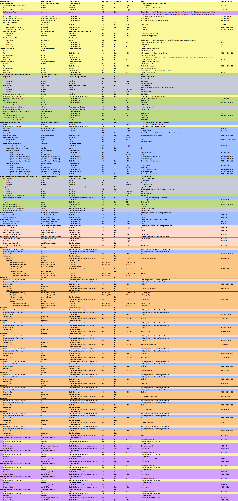

# Comprehensive - CH IDMP (R5) v1.0.0-ballot

* [**Table of Contents**](toc.md)
* **Comprehensive**

## Comprehensive

This chapter presents various products in the IDMP / FHIR format.

### Comprehensive Sample Combipack

The following data example illustrates the composition of the product Comprehensive Sample Combipack.

This dataexample is a not existing product created to represent a full data example with all datafields filled. The data for this phantasy product is a combination of…

#### FHIR Examples

Representation of IDMP data attributes as FHIR XML and JSON: [FHIR Example](Bundle-200f39aa-ddd8-48a2-a05e-8e4b4e6ac847.md)

#### IDMP Dataexample

Representation of IDMP/FHIR data elements: 

*Fig. 2: Comprehensive Example*

