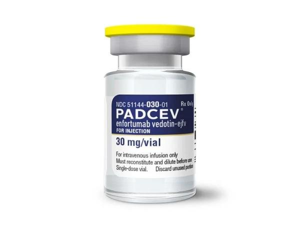
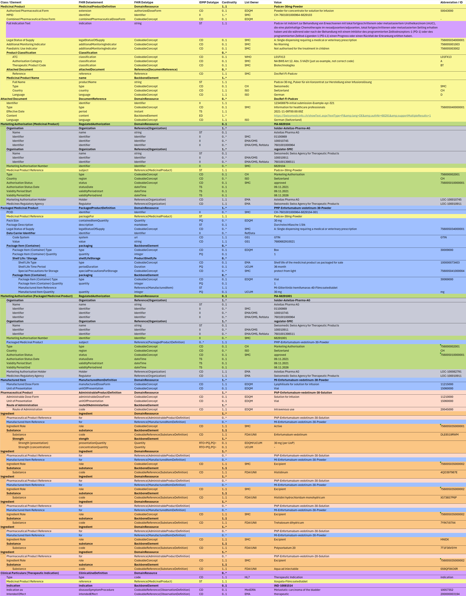

# Padcev30 - CH IDMP (R5) v1.0.0-ballot

* [**Table of Contents**](toc.md)
* **Padcev30**

## Padcev30

This chapter presents various products in the IDMP / FHIR format.

### Padcev 30 mg 1 Durchstechflasche

The following data example illustrates the composition of the product Padcev 30 mg

#### Description

Padcev ist indiziert zur Behandlung von Erwachsenen mit lokal fortgeschrittenem oder metastasiertem Urothelkarzinom (mUC), die eine platinhaltige Chemotherapie im neoadjuvanten/adjuvanten, lokal fortgeschrittenen oder metastasierten Setting erhalten haben und die während oder nach der Behandlung mit einem Inhibitor des programmierten Zelltodrezeptors-1 (PD-1) oder des programmierten Zelltod-Liganden 1 (PD-L1) einen Progress oder einen Rückfall der Erkrankung erlitten haben.

*Fig. 1: PADCEV 30 mg*

#### FHIR Examples

Representation of IDMP data attributes as FHIR XML and JSON: [FHIR Example](Bundle-52ae1101-1e39-4280-b6dc-b505d7501b2b.md)

#### IDMP Dataexample

Representation of IDMP/FHIR data elements: 

*Fig. 2: PADCEV 30 mg*

