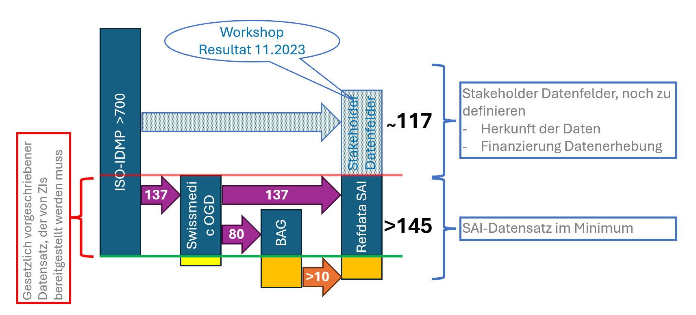
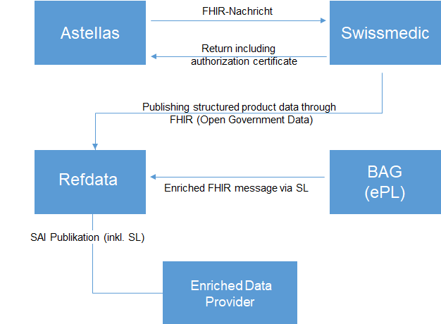
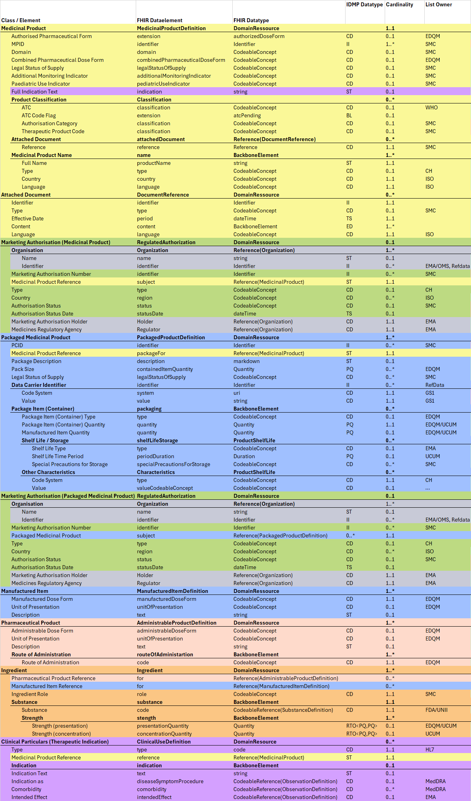

# Project Description - CH IDMP (R5) v1.0.0-ballot

* [**Table of Contents**](toc.md)
* **Project Description**

## Project Description

### Introduction

The CH IDMP project - a cooperation between Astellas and Refdata is a knowledge creation project for the introduction of IDMP in Switzerland. The dataformat is based on FHIR IDMP.

### Data Element Counting

The following illustration indicates illustrates the number of dataelements incl. the flow from the data source - the Marketing Authorisation Holder - to SAI.

For the Dataimport the FHIR format must be used. 

*Fig. 1: Data Pipeline*

### Data Pipeline

The following datapipeline illustrates the dataflow from the data source - the Marketing Authorisation Holder to SAI and further to the FOPH as well as to the data enhancer organisations. The dataflow from the Marketing Authorisation Holder to Swissmedic is grayed out, as Swissmedic is a observer at the project, as they do not have a software to attend the pilot project.

For the Dataimport the FHIR format must be used. 

*Fig. 2: Data Pipeline*

### FHIR Document Bundle

This exchange format is defined as a document type that corresponds to a Bundle as a FHIR resource. A Bundle has a list of entries. The first entry is the Composition, in which all contained entries are then referenced.

*Fig. 3: Bundle - Authorised Medicinal Products*

