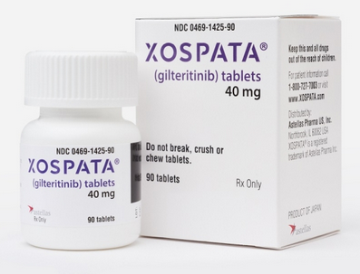
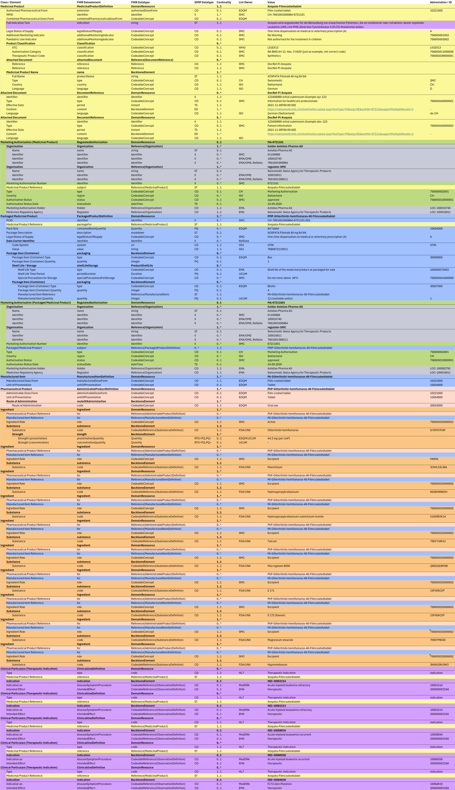

# Xospata - CH IDMP (R5) v1.0.0-ballot

* [**Table of Contents**](toc.md)
* **Xospata**

## Xospata

This chapter presents various products in the IDMP / FHIR format.

### XOSPATA 40 mg 84 Stk

The following data example illustrates the composition of the product Xospata 40 mg

#### Description

Xospata wird angewendet für die Behandlung von erwachsenen Patienten, die an rezidivierter oder refraktärer akuter myeloider Leukämie (AML) mit FMS-ähnlichen Tyrosinkinase 3 (FLT3)-Mutationen leiden.

*Fig. 5: PADCEV 30 mg*

#### FHIR Examples

Representation of IDMP data attributes as FHIR XML and JSON: [FHIR Example](Bundle-ab55cf13-a819-4875-adaa-5545e2cbdddf.md)

#### IDMP Dataexample

Representation of IDMP/FHIR data elements: 

*Fig. 6: XOSPATA 40 mg*

