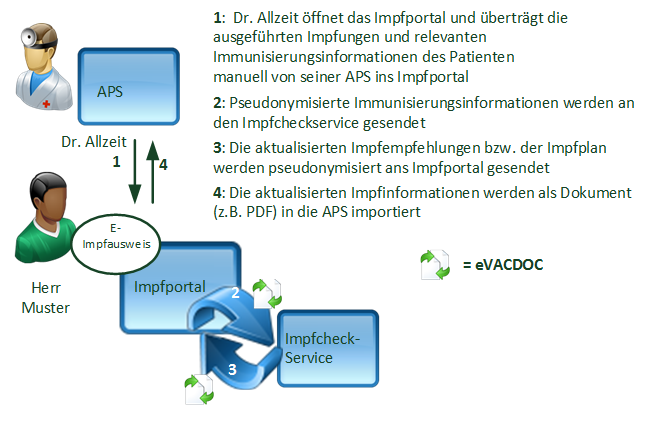

# Usecase 2 Cda De - Implementation Guide CH VACD v6.0.0

* [**Table of Contents**](toc.md)
* **Usecase 2 Cda De**

## Usecase 2 Cda De

# UC 2: Ambulante Impfstelle mit elektronischer KG

Ausführlichere Bezeichnung: Impfstelle arbeitetet digital mit elektronischer Krankengeschichte

## UC 2a: Ohne strukturierte Impfinformationen

**Fig.: Use Case 1 (DE)**

## UC 2b: Mit strukturierten Impfinformationen

**Fig.: Use Case 1 (DE)**

## UC 2c: Synchronisation mit e-Impfportal

**Fig.: Use Case 1 (DE)**

