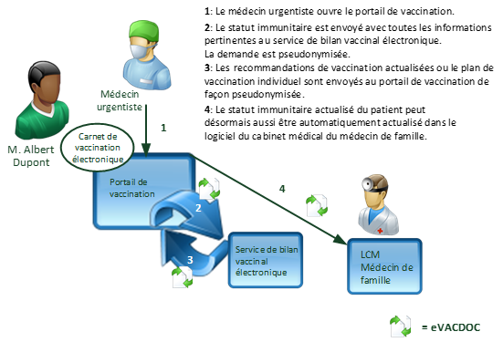

# Usecase 2 Cda Fr - Implementation Guide CH VACD v6.0.0

* [**Table of Contents**](toc.md)
* **Usecase 2 Cda Fr**

## Usecase 2 Cda Fr

# UC 2: Centre de vaccination ambulatoire avec DM électronique

## UC 2a: Sans informations de vaccination structurées

**Fig.: Use Case 1 (DE)**

## UC 2b: Avec informations de vaccination structurées

**Fig.: Use Case 1 (DE)**

## UC 2c: Synchronisation avec le portail électronique de vaccination

**Fig.: Use Case 1 (DE)**

